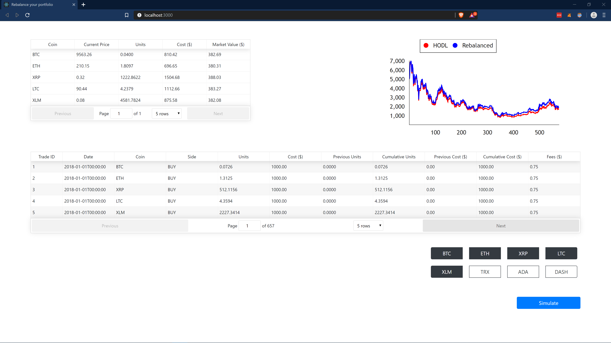

# rebalance
### Contributors: Chris Wallwork, Carter Carlson

### Project Goals
* React front end
* Display coin transactions and summaries in a clean, easy to understand
format
* Functional product to rebalance personal funds or simulate rebalance
* Allow users to select which coins/dates they want to simulate

### Current Project Status
So far, we're able to simulate purchasing 5 coins and rebalancing them over a specific
period of time.  More to come.

---

### Introduction
This repository merges two similar repositories:
* __[crypto-simulations](https://github.com/cartercarlson/crypto-simulations)__
  * Simulates rebalancing a randomly selected basket of 5 coins 250 times and records the total value of the portfolio
    over the course of the simulation.
  * Compares overall hodl performance to rebalanced performance.
* __[transaction-log](https://github.com/cartercarlson/transaction-log)__
  * Rebalances a specific basket of coins and captures details of the transactions
  * Can be simulated or used for personal rebalancing

### Repository Comparison
While the two repositories have similar purposes, they were made separately and have different code structures.
* __Code Structure__
  * _crypto-simulations_:
    * Utilizes many separate lists
    * Zips the lists together
  * _transaction-log_:
    * Portfolio object
    * Methods for portfolio class are outside the class in functions
* __Pros__
  - _crypto-simulations_
    * Optimizes simulation speed for a large number of backtests
    * Compares rebalancing periods and the performance of randomly selected coin portfolios
  * _transaction-log_:
    * Documents relevant data of every transaction over the simulation period for a specific portfolio
    * Can be used to rebalance a real portfolio on an exchange

* __Cons__
  * _crypto-simulations_:
    * Only simulates rebalancing: can't be used for personal rebalancing
    * Unable to store data from transactions
    * Code is lightweight, making it hard to follow
  * _transaction-log_:
    * Cannot scale to multiple backtests
    * Portfolio methods should be inside the class, not outside functions
